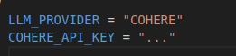
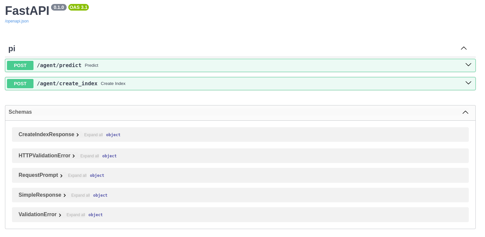
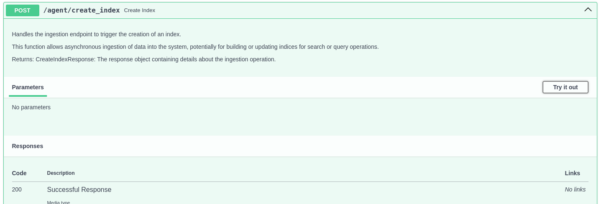
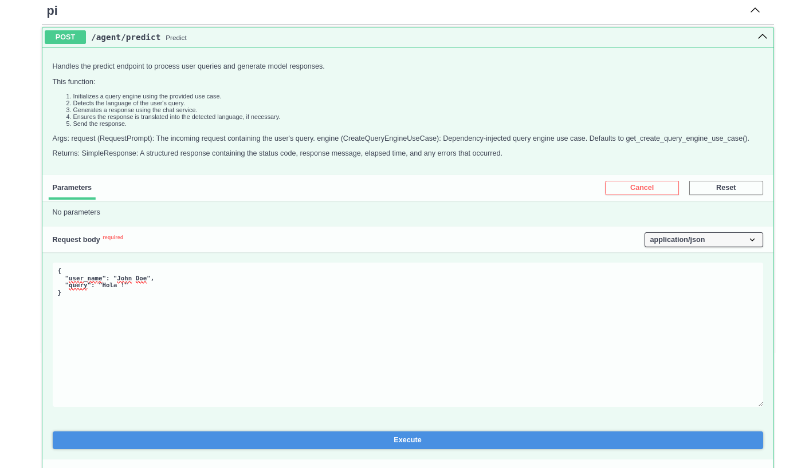

# PI_BOT

**PI_BOT** is an API providing a virtual assistant capable of responding to queries made against a specific set of documents stored in the `/knowledge_base` folder.

## Main Endpoints
The microservice includes the following endpoints, defined in `pi_agent_core/routers/agent.py`:

- **`/predict`**: Executes a user query using the knowledge base. The output is the response generated by the virtual assistant.
- **`/create_index`**: Generates a vector store index from the information contained in the knowledge base. The index is stored in `pi_agent_core/index_generation/storage/vector_store`.

---
## Core Technologies
- **Python**: Primary language for service development.
- **FastAPI**: Framework used to create a fast, robust, and documented API.
- **Llama-Index**: Tool used for generating and querying the vector index.
- **ChromaDB**: Database specialized in storing and retrieving vector data.
- **Docker**: Facilitates deployment and portability of the microservice.

---
## Core Technologies
The microservice utilizes a modern and efficient technology stack:
- **Python**: Primary language for service development.
- **FastAPI**: Framework used to create a fast, robust, and documented API.
- **Llama-Index**: Tool used for generating and querying the vector index.
- **ChromaDB**: Database specialized in storing and retrieving vector data.
- **Docker**: Facilitates deployment and portability of the microservice.

---
## Microservice Structure
The microservice design follows an **Onion Architecture**. This approach was chosen to ensure clear separation of concerns, improve maintainability, and facilitate scalability.

### Main Folders:
- **`config`**: Contains essential configurations for microservice operation, including agent parameters and key paths.
- **`knowledge_base`**: Stores the documents that feed the knowledge base. This information is used to generate the vector index.
- **`pi_agent_core`**: The API core, structured as follows:
  - **`application`**: Implements specific use cases, such as services for interacting with the user and generating the query engine.
  - **`helpers`**: Contains utility functions that can be reused in different parts of the microservice.
  - **`index_generation`**: Handles creating the vector index from knowledge base data.
  - **`infrastructure`**: Interacts with external services, like AI tools and vector store management.
  - **`routers`**: Defines API endpoints, including `'/predict'` and `'/create_index'`.
  - **`app.py`**: Main API configuration using the FastAPI framework.

---
## `.env` File Configuration
The `.env` file must be configured to define the LLM (Large Language Model) provider to use. This microservice supports the following AI providers:

1. **Cohere**
2. **Azure OpenAI**
3. **OpenAI**

### Variables to define in the `.env` file:
- **`LLM_PROVIDER`**: Defines the LLM provider to use. Options: `"COHERE"`, `"AZURE"`, `"OPENAI"`. Defaults to **Cohere** if undefined.
- **API Key**: Specify the corresponding API key depending on the selected provider.

### Example `.env` configuration using Cohere:


LLM_PROVIDER="COHERE"
COHERE_API_KEY="tu_cohere_api_key"

---
## Working Environment
We strongly recommend that you use the virtual environment for your daily work. This will keep your global environment clean. On the other hand, installing [pyenv](https://github.com/pyenv/pyenv) will be useful for managing different Python versions.

---
## Package Management
We decided to use Poetry as package manager for reproducibility, among others. For more information please refer to their documentation [here](https://python-poetry.org/docs/).


Cloning the repository:

```shell
$ git clone https://github.com/mcassiani/pi_bot.git && cd pi_bot
```

Installing libraries

```shell
$ poetry install --with dev
```


### Install pre-commit
To get the `pre-commit` up and running run the next command into the terminal:

```shell
poetry run pre-commit install
```


### Running the API
It will depends on where you are stepped, but if you are into the root run the next command:

```shell
$ poetry run uvicorn pi_agent_core.app:app
```


### Running with Docker
If you want to build and run the image on your local machine, follow these steps:

1. Add the `COHERE_API_KEY` environment variable to the `Dockerfile`, placing it below the other environment variables. For example:
```docker

# Set environment variables
ENV POETRY_VERSION=$POETRY_VERSION \
    POETRY_NO_INTERACTION=1 \
    POETRY_VIRTUALENVS_CREATE=false \
    COHERE_API_KEY="..."

```

2. Build the image using the following command:
```shell
$ docker build -t <image_name> .
```

3. Run the image:
```shell
$ docker run -p 8000:8000 <image_name>.
```

4. Open your browser and navigate to localhost or the specified port, appending /docs to the URL. Example:
    `http://0.0.0.0:8000/docs`

---
## TEST API

Follow these steps to effectively configure and test the API:

1. **Configure the `.env` file:** Before starting, make sure you have correctly configured the `.env` file. Refer to the section [Configure the `.env` file](#configuración-del-archivo-env) for more details.

2. **Start the API:** Run the microservice following the steps in the section [Run the API](#running-the-api).

3. **Access the FastAPI interface:** Once the API is running, open your browser and navigate to the FastAPI interactive documentation interface. To do this, add `/docs` to the end of the base URL. Example:
  - **Initial output:** `http://127.0.0.1:8000/`
  - **URL with documentation:** `http://127.0.0.1:8000/docs`

4. **View the FastAPI interface:** When accessing the `/docs` route, you should see an interface like this:
  

5. **Generate the index before predicting:** Before making your first query, it is necessary to generate the vector index. To do this, execute the `POST /create_index` endpoint in the FastAPI interface.
  

6. **Make queries to the assistant:** Once the index is generated, you can start making queries to the assistant using the `POST /predict` endpoint.

  

---
## Enjoy!
With this, you're all set to interact with the API and enjoy its functionality. 🚀
